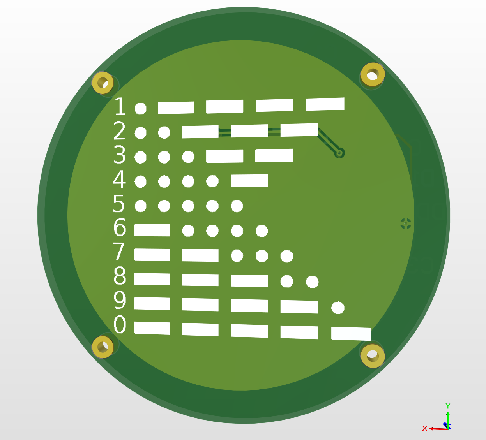
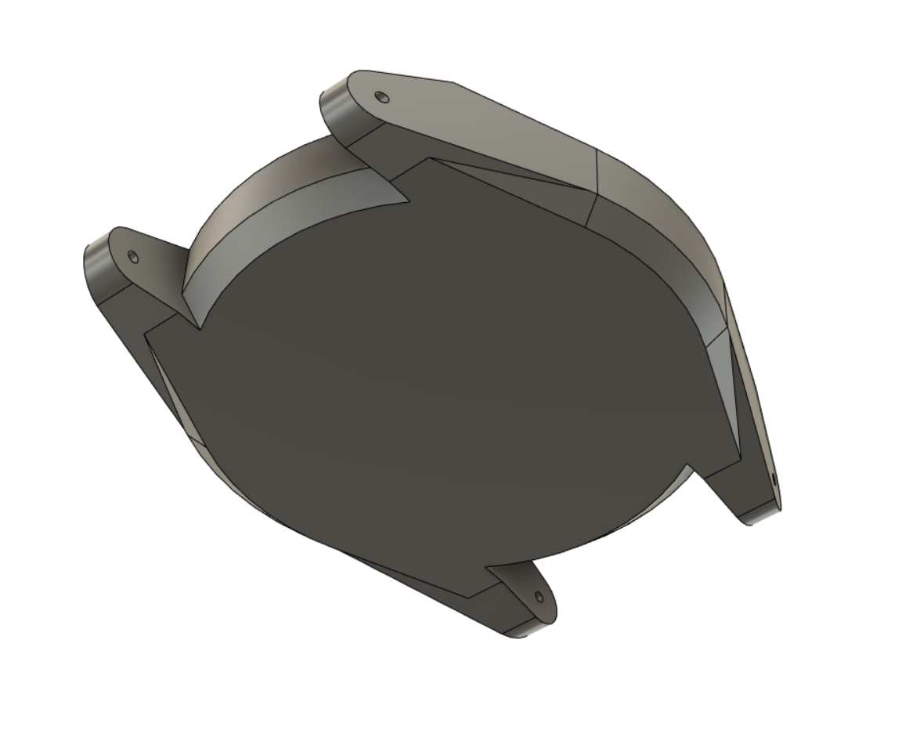

```
                                                                          
                                                                          
  ______   ______       ______       ______               ______   ______ 
 /_____/  /_____/      /_____/      /_____/              /_____/  /_____/ 
                                /\           /\      /\                   
                                \/           \/      \/                   
```

# Morse Code Watch

The `Morse Code Watch` is quite simply a watch that tells you the time in morse code. Touch the top of the watch and it will vibrate out the current time in Morse code.

<p align="center">
    
    
</p>


<p align="middle">
  
  
</p>


<p align="middle">
  
  
</p>


## Block Diagram


## Dependencies

The software for this project only has one explicit dependency [JChristensen/DS3232RTC](https://github.com/JChristensen/DS3232RTC)
implicitly the `DS3232RTC` library written by *JChristensen* includes a time library it was designed to work with [PaulStoffregen/Time](https://github.com/PaulStoffregen/Time).

This dependency can be added via Arduino's library manager follow this [guide](https://docs.arduino.cc/software/ide-v1/tutorials/installing-libraries).

## Setup Guides
- [Add Attiny85 board to Arduino IDE](http://highlowtech.org/?p=1695)
- [Tiny AVR Programmer Hookup](https://learn.sparkfun.com/tutorials/tiny-avr-programmer-hookup-guide/all)
- [Software Serial on Attiny85](https://jloh02.github.io/projects/connecting-attiny85-serial-monitor/)

## μController Pinout

Specifically this project uses an ATtiny85 as its μController.


## Morse Code


